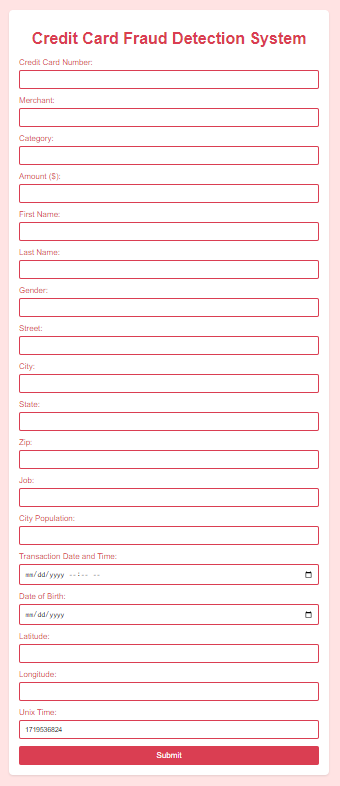

# Credit Card Fraud Detection

This project aims to develop a robust machine learning model integrated into a Flask web application to detect fraudulent credit card transactions in real-time. Utilizing advanced data preprocessing techniques and a RandomForest classifier, this system provides high accuracy and adaptability to evolving fraud patterns.

## Table of Contents
- [Introduction](#introduction)
- [Features](#features)
- [Prerequisites](#prerequisites)
- [Installation](#installation)
- [Usage](#usage)
- [API Endpoints](#api-endpoints)
- [Dataset](#dataset)
- [Model](#model)
- [Contributing](#contributing)
- [License](#license)
- [Contact](#contact)

## Introduction

The increasing sophistication of financial fraud necessitates advanced solutions capable of adapting to new fraud patterns. This project addresses these challenges by developing a machine learning-based fraud detection system integrated into a user-friendly Flask web application.

## Features

- **Real-Time Prediction**: Predict fraudulent transactions based on real-time input data.
- **Advanced Data Preprocessing**: Includes feature engineering and data balancing to handle class imbalances.
- **User-Friendly Interface**: Web-based interface for easy interaction and monitoring.
- **High Accuracy**: Utilizes a RandomForest classifier for precise fraud detection.
- **Scalability**: Designed to handle increasing transaction volumes efficiently.

## Prerequisites

Before you begin, ensure you have the following requirements:

- Python 3.6 or higher
- Pip (Python package installer)
- Git (for cloning the repository)

## Installation

1. **Clone the repository:**
   ```bash
   git clone https://github.com/AbdulRehmanRattu/Credit-Card-Fraud-Detection
   cd Credit-Card-Fraud-Detection
   ```

2. **Install the necessary Python packages:**
   ```bash
   pip install -r requirements.txt
   ```

3. **Ensure you have the trained model and encoders in the correct directories:**
   The trained model should be named `fraud_detection_model.pkl` and placed in the root directory. Encoders should be in an `encoders` directory within the root directory.

## Usage

To run the application, execute the following command:
```bash
python app.py
```
Then, open a web browser and navigate to `http://0.0.0.0:5000/` to access the application.

## User Interface


## API Endpoints

- **GET `/`**: Homepage displaying the form to input transaction data.
- **POST `/predict`**: Endpoint to submit transaction data and receive a fraud prediction.

## Dataset

The model was trained using the "Credit Card Transactions Fraud Detection Dataset" from Kaggle. You can find the dataset [here](https://www.kaggle.com/datasets/kartik2112/fraud-detection?select=fraudTrain.csv). This dataset includes simulated credit card transactions from 1st Jan 2019 to 31st Dec 2020, involving 1000 customers and 800 merchants.

## Model

The fraud detection model is a RandomForest classifier, trained to distinguish between fraudulent and legitimate transactions. The model and its associated encoders are crucial for the application's functionality.

### Model Loading
```python
import joblib
model = joblib.load('fraud_detection_model.pkl')
encoders = {
    'merchant': joblib.load('encoders/merchant_encoder.pkl'),
    'category': joblib.load('encoders/category_encoder.pkl'),
    'first': joblib.load('encoders/first_encoder.pkl'),
    'last': joblib.load('encoders/last_encoder.pkl'),
    'gender': joblib.load('encoders/gender_encoder.pkl'),
    'street': joblib.load('encoders/street_encoder.pkl'),
    'city': joblib.load('encoders/city_encoder.pkl'),
    'state': joblib.load('encoders/state_encoder.pkl'),
    'job': joblib.load('encoders/job_encoder.pkl')
}
```

## Contributing

Contributions are welcome! If you have suggestions or improvements, please fork the repository and create a pull request. For major changes, open an issue first to discuss what you would like to change.

## License

This project is distributed under the MIT License. See the `LICENSE` file for more information.

## Contact

Abdul Rehman Rattu  
[LinkedIn](https://www.linkedin.com/in/abdul-rehman-rattu-395bba237)  
Project Link: [GitHub](https://github.com/AbdulRehmanRattu/Credit-Card-Fraud-Detection)


